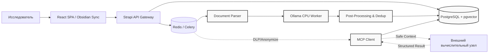

# ARCHITECTURE.md — Система «Engels»

## 1. Обзор и Назначение
Система «Engels» — вычислительное ядро для автоматизации историко-материалистического анализа. Преобразует неструктурированные исторические документы в верифицируемый граф причинно-следственных связей. Является единым источником правды (Single Source of Truth) для всех исследовательских проектов группы.

## 2. Архитектурные Принципы (Методология → Техническая реализация)
| Методологический принцип | Техническая реализация |
|---|---|
| **Причинность > Хронология** | Граф строится вокруг типизированных предикатов (`caused_by`, `influences`, `opposes`, `part_of`). Хронология — вторичный атрибут сущности. |
| **Объективность данных** | Запрет на генерацию фактов. Каждая связь обязательна сопровождается `evidence_quote` (цитатой) и `source_id`. |
| **Верифицируемость** | Двухслойная модель: `raw` (LLM/MCP гипотеза) → `verified` (подтверждено исследователем). Полный аудит правок и журнал статусов. |
| **Замкнутый контур** | Локальный инференс (CPU/Ollama) по умолчанию. Внешние API запрещены. Данные не покидают периметр. |
| **Универсальность** | Один движок. Проекты изолируются через теги, фильтры и логические пространства в БД/Strapi. |

## 3. Контекст Системы и Границы

- **Внутренний контур (Trusted):** Strapi, Celery, PostgreSQL, Ollama, React UI, DLP-анонимайзер.
- **Внешний контур (Untrusted):** MCP-серверы/боты. Получают только обезличенные структуры задач. Возвращают только JSON-схемы связей.

## 4. Компонентная Модель
| Компонент | Технология | Ответственность |
|---|---|---|
| **API / CMS** | Strapi v4 | Управление документами, RBAC, кастомные эндпоинты графа, Obsidian-экспорт |
| **Очередь задач** | Celery + Redis | Маршрутизация, ретраи, балансировка `local_ollama` / `mcp_external`, Circuit Breaker |
| **Парсер** | Python `unstructured` | Приём PDF/TXT/MD, очистка, семантический чанкинг (512–768 токенов, overlap 15%) |
| **LLM-Воркер** | Ollama (`qwen2.5:7b` / `llama3:8b` Q4_K_M) | NER, извлечение связей, оценка `confidence_score` (CPU-инференс) |
| **MCP-Шлюз** | Python `mcp` SDK + DLP-модуль | Анонимизация контекста, отправка задач, восстановление токенов, маркировка `source_mcp` |
| **Хранилище** | PostgreSQL 15+ + `pgvector` | Граф сущностей, эмбеддинги (HNSW), JSONB-метаданные, версионирование |
| **Фронтенд** | React + TS, `@xyflow/react`, `vis-timeline` | Split-view верификация, визуализация графа/таймлайна, фильтрация по базису/надстройке |
| **Infra** | Docker Compose, Gitea Actions, Makefile | Изолированная среда, локальный CI/CD, линт/тест/сборка |

## 5. Конвейер Обработки Данных (Data Flow)
1. **Upload:** Пользователь загружает документ в Strapi → создаётся запись в `sources` и задача в Celery.
2. **Chunking:** Парсер разбивает текст, сохраняет фрагменты в `text_chunks` + генерирует эмбеддинги.
3. **Routing:** Task Router решает: `local_ollama` (по умолчанию) или `mcp_external` (тяжёлый анализ/кластеризация).
4. **Extraction:** 
   - *Локально:* Промпт → Ollama → Pydantic-валидация → `entities`/`relations` (`status=raw`)
   - *Через MCP:* DLP-анонимизация → отправка → ответ → обратный маппинг → сохранение (`status=raw`, `source_mcp=true`)
5. **Verification:** Исследователь проверяет связи в UI. Подтверждает/отклоняет → статус меняется на `verified`/`rejected`.
6. **Publish/Export:** Проверенные данные доступны для аналитики, экспорта в Markdown (Obsidian) или формирования отчётов.

## 6. Модель Хранения Данных (Ключевые сущности)
- `sources`: Метаданные документов, путь к файлу, статус обработки.
- `text_chunks`: Текст фрагмента, `embedding` (vector), `source_id`, `chunk_index`.
- `entities`: Узлы графа. `name`, `type` (class/person/event/concept), `category` (base/superstructure).
- `relations`: Рёбра графа. `subject_id`, `object_id`, `predicate`, `confidence_score`, `status` (raw/verified/rejected), `evidence_quote`, `source_mcp`.
- **Индексы:** FK по `subject/object`, HNSW по `embedding`, GIN по `JSONB` метаданным.

## 7. Безопасность и Интеграция MCP
- **DLP-фильтр:** Перед отправкой по MCP NER-модуль заменяет имена, даты, топонимы на маркеры (`[ENT_1]`, `[DATE_X]`). Карта маппинга хранится **только в RAM** воркера и удаляется после ответа.
- **Circuit Breaker:** При `>5%` ошибок или таймауте `>15 сек` маршрутизация мгновенно переключается на `local_ollama`. Восстановление по экспоненциальной задержке.
- **Строгая маркировка:** Все данные от MCP получают `source_mcp=true`, `status='raw'`. **Автоматический перевод в `verified` запрещён.**
- **Логирование:** Логируются только метаданные (ID задачи, статус, время). Сырые тексты, эмбеддинги и токены **никогда не пишутся в логи**.

## 8. Инфраструктура и Развёртывание
- **Dev/Stage:** `docker compose up -d` (DB, Redis, Strapi, Ollama, Workers).
- **Prod:** k3s кластер (опционально), локальный Container Registry, WireGuard для доступа к узлам.
- **CI/CD:** Gitea Actions → линт (`ruff`, `tsc`) → тесты (`pytest`, `testcontainers`) → сборка образов → пуш в локальный реестр.
- **Ресурсы:** CPU-инференс, `OLLAMA_NUM_PARALLEL=2`, `OLLAMA_KEEP_ALIVE=5m`, RAM-лимиты на воркерах.

## 9. Технические Ограничения и KPI
| Метрика | Целевое значение | Контроль |
|---|---|---|
| Автономность | `100%` без внешних API | Отключение сети → система продолжает работу |
| Точность NER | `≥85%` на исторических текстах | Выборка 100 сущностей пилотного корпуса |
| Дедупликация | `≥90%` слияния синонимов | Fuzzy-matching тесты на эталонном наборе |
| UI Performance | `<1.5 сек` при `~100 000 узлов` | Виртуализация React-Flow + HNSW-индексы |
| MCP Fallback | `<200 мс` на переключение очередей | Интеграционные тесты с имитацией сбоя |

## 10. Правила для AI-Генерации (coder.qwen.ai)
1. `Follow contracts strictly. Do not invent fields, endpoints, or dependencies.`
2. `Pin all library versions. Use exact matches from pyproject.toml / package.json.`
3. `Generate unit/integration tests alongside implementation. Use testcontainers for DB.`
4. `Never log raw text, embeddings, or MCP token maps.`
5. `If ambiguous, ask for clarification instead of guessing.`

---
📁 *Рекомендуемое расположение:* Корень репозитория (`engels-system/ARCHITECTURE.md`).  
🔗 *Связанные документы:* `database/schema.sql`, `CONTRACTS/`, `testdata/`, `Makefile`.
