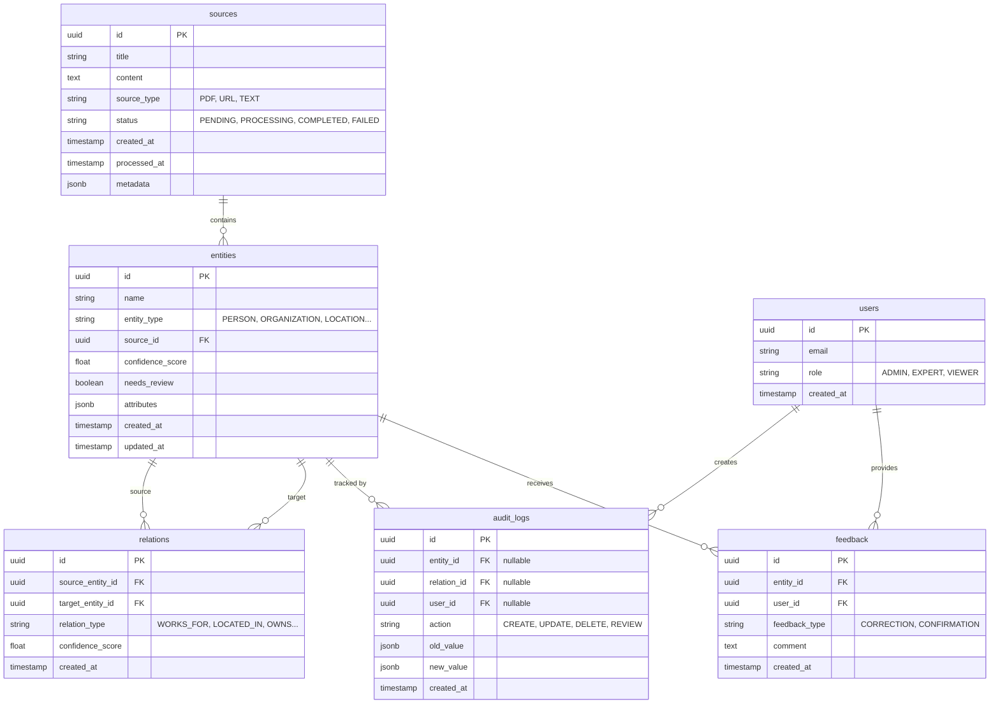

# Database Schema Documentation

This document describes the database schema for the Entity Extraction System. It covers tables, relationships, indexes, and migration strategies.

## Overview

The system uses **PostgreSQL** as the primary relational database. It stores extracted entities, their relationships, source documents, audit logs, and user feedback.

## Entity Relationship Diagram (ERD)



## Table Details

### 1. `sources`
Stores original documents or text blocks from which entities are extracted.

| Column | Type | Description |
| :--- | :--- | :--- |
| `id` | UUID | Primary Key |
| `title` | VARCHAR(255) | Human-readable title of the source |
| `content` | TEXT | Raw text content (or path to S3 if large) |
| `source_type` | VARCHAR(50) | Enum: `PDF`, `URL`, `TEXT`, `DOCX` |
| `status` | VARCHAR(50) | Processing status: `PENDING`, `PROCESSING`, `COMPLETED`, `FAILED` |
| `created_at` | TIMESTAMP | Creation time |
| `processed_at` | TIMESTAMP | Time when processing finished |
| `metadata` | JSONB | Extra info (e.g., URL, file size, author) |

**Indexes:**
- `idx_sources_status` on `status` (for worker polling)
- `idx_sources_created_at` on `created_at`

### 2. `entities`
The core table storing extracted real-world objects.

| Column | Type | Description |
| :--- | :--- | :--- |
| `id` | UUID | Primary Key |
| `name` | VARCHAR(255) | Normalized name of the entity |
| `entity_type` | VARCHAR(100) | Category (e.g., `Person`, `Company`) |
| `source_id` | UUID | FK to `sources.id` |
| `confidence_score` | FLOAT | LLM confidence (0.0 - 1.0) |
| `needs_review` | BOOLEAN | Flag for human-in-the-loop verification |
| `attributes` | JSONB | Dynamic properties (e.g., `{"birth_date": "1990-01-01"}`) |
| `created_at` | TIMESTAMP | Creation time |
| `updated_at` | TIMESTAMP | Last update time |

**Indexes:**
- `idx_entities_type` on `entity_type`
- `idx_entities_source` on `source_id`
- `idx_entities_review` on `needs_review` WHERE `needs_review` is true (partial index)
- `idx_entities_name` on `name` (GIN index for full-text search if needed)

### 3. `relations`
Stores connections between two entities.

| Column | Type | Description |
| :--- | :--- | :--- |
| `id` | UUID | Primary Key |
| `source_entity_id` | UUID | FK to `entities.id` (start of relation) |
| `target_entity_id` | UUID | FK to `entities.id` (end of relation) |
| `relation_type` | VARCHAR(100) | Type of connection (e.g., `EMPLOYEES`, `OWNED_BY`) |
| `confidence_score` | FLOAT | Confidence in this relation |
| `created_at` | TIMESTAMP | Creation time |

**Constraints:**
- `source_entity_id` != `target_entity_id` (No self-loops unless explicitly allowed)
- Unique constraint on `(source_entity_id, target_entity_id, relation_type)` to prevent duplicates.

### 4. `audit_logs`
Immutable log of all changes for compliance and debugging.

| Column | Type | Description |
| :--- | :--- | :--- |
| `id` | UUID | Primary Key |
| `entity_id` | UUID | FK to `entities.id` (if applicable) |
| `relation_id` | UUID | FK to `relations.id` (if applicable) |
| `user_id` | UUID | FK to `users.id` (who made the change) |
| `action` | VARCHAR(50) | `CREATE`, `UPDATE`, `DELETE`, `REVIEW_APPROVED`, `REVIEW_REJECTED` |
| `old_value` | JSONB | Snapshot of data before change |
| `new_value` | JSONB | Snapshot of data after change |
| `created_at` | TIMESTAMP | Timestamp of action |

**Note:** This table is append-only. Never update or delete rows here.

### 5. `feedback`
Stores explicit corrections or confirmations from human experts.

| Column | Type | Description |
| :--- | :--- | :--- |
| `id` | UUID | Primary Key |
| `entity_id` | UUID | FK to `entities.id` |
| `user_id` | UUID | FK to `users.id` |
| `feedback_type` | VARCHAR(50) | `CORRECTION`, `CONFIRMATION` |
| `comment` | TEXT | Explanation of the feedback |
| `created_at` | TIMESTAMP | Timestamp |

## Migration Strategy

We use **Alembic** (for SQLAlchemy) or raw SQL scripts managed via a migration tool.

### Rules for Migrations:
1.  **Never break existing data**: Always provide default values or `NULL` allowed columns for new fields.
2.  **Backwards compatibility**: API code must work during the migration window.
3.  **Rollback plan**: Every migration must have a valid `downgrade()` function.
4.  **Data migrations**: If data transformation is needed, do it in a separate transaction within the migration.

### Example Migration (Add `needs_review` column):

```python
# revisions/001_add_needs_review.py
def upgrade():
    op.add_column('entities', sa.Column('needs_review', sa.Boolean(), nullable=True, default=False))
    # Backfill existing rows
    op.execute("UPDATE entities SET needs_review = FALSE WHERE needs_review IS NULL")
    op.alter_column('entities', 'needs_review', nullable=False)

def downgrade():
    op.drop_column('entities', 'needs_review')
```

## Backup and Recovery

- **Backups**: Daily full backups via `pg_dump` + WAL archiving for point-in-time recovery.
- **Retention**: 30 days of daily backups, 7 days of hourly snapshots.
- **Recovery Test**: Monthly restore drills to verify backup integrity.

## Performance Considerations

- **Partitioning**: If `audit_logs` or `sources` grow beyond 10M rows, consider partitioning by `created_at`.
- **Archiving**: Move processed `sources` older than 1 year to cold storage (S3) and keep only metadata in DB.
- **Connection Pooling**: Use PgBouncer in production to manage database connections efficiently.
